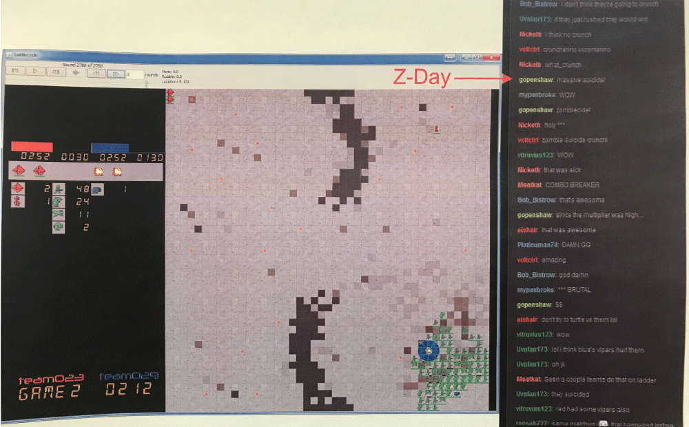

# Battlecode 2016

Team **what_thesis**: _Aaron, Stephen, Ryan, Tamas_

## Results

Our bot finished in 7th/8th place in the 2016 Battlecode tournament, also winning a strategy prize for our Z-day suicide strategy. See team023 for the final version.

## Explanation of the tournament

Great writeup by Greg McGlynn:
http://www.anatid.net/2016/02/battlecode-2016-post-mortem-future.html
